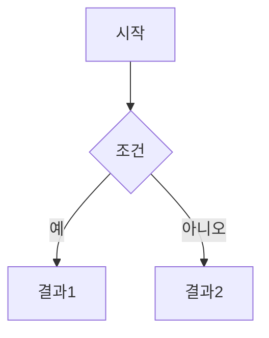

## 소제목 1

본문은 여기부터 마크다운 문법으로 자유롭게 작성하면 됩니다. `title`은 front matter에서 이미 맨 위에 자동으로 표시되므로, 본문에서는 `##`(h2)부터 제목을 시작하는 게 구조상 깔끔합니다.

- 목록 항목 1
- 목록 항목 2
- 목록 항목 3

> 인용문은 이렇게 씁니다.

## 코드블록 예시

언어를 명시하면 문법 강조(syntax highlighting)가 적용됩니다.

```python
def hello():
    print("Hello, Chirpy!")
```

## 이미지 예시

<!-- 이미지는 `assets/img/` 폴더에 넣고 아래처럼 불러옵니다. -->

<!--  -->

## 표 예시

| 항목 | 설명 |
|------|------|
| A    | 설명A |
| B    | 설명B |

## 수식 예시 (front matter의 math: true 필요)

인라인 수식: $E = mc^2$

블록 수식:

$$
\sum_{i=1}^{n} i = \frac{n(n+1)}{2}
$$

## 다이어그램 예시 (front matter의 mermaid: true 필요)



## 소제목 2

마무리 문단을 여기에 작성하세요.
