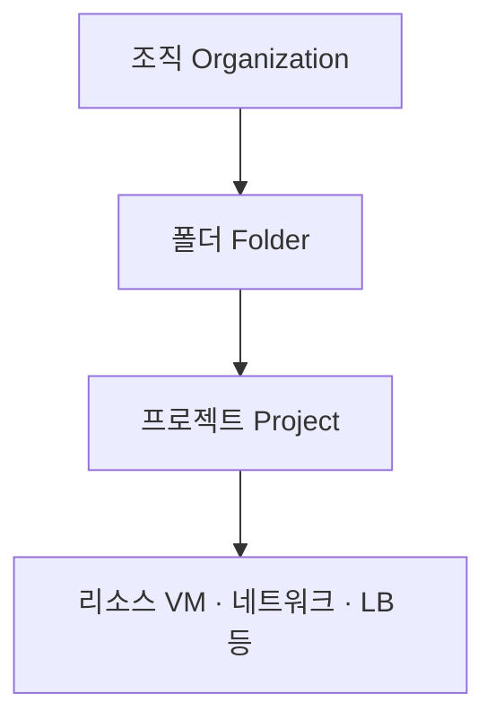
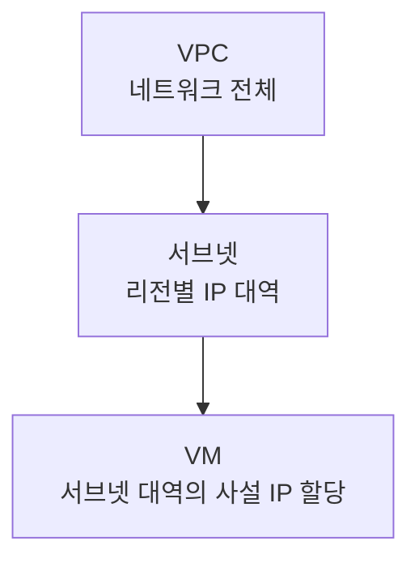

# 서론

클라우드, 네트워크 인프라 등등.. 을 처음 시작하는 사람으로서 초반에 알아둬야 할 기본 개념들을 넓고 얕게 훑는 글이다. <br>
깊이 파고들기보다는 이런 게 있다 정도로 톺아보는 데에 목적을 뒀다.

<br><br>

# 본론

## 1. 계정 구조

GCP는 리소스를 계층 구조로 관리한다.



이 중 제일 중요한 단위는 **프로젝트(Project)**로,

- 모든 리소스(VM, 네트워크, 로드밸런서 등)는 **반드시 하나의 프로젝트에 속한다.**
- **결제도 프로젝트 단위**로 묶인다.
- 프로젝트마다 고유한 ID가 있다 (예: `my-first-project-01`).

그래서 CLI로 작업할 때는 항상 "지금 내가 어느 프로젝트에서 작업 중인가"를 의식하는 습관이 중요하다.
<br> 엉뚱한 프로젝트에 리소스를 만들거나, 권한이 없어서 막힐 수 있다.

```bash
# 현재 설정(계정, 프로젝트, 리전 등) 확인
gcloud config list

# 작업할 프로젝트 지정
gcloud config set project [PROJECT_ID]
```

<br><br>

## 2. Region과 Zone

클라우드 서버는 전 세계 데이터센터에 실제로 존재하는데, 그 위치를 가리키는 개념이 리전과 존이다.

- **리전(Region)**: 지리적 지역. 예) `europe-west3` = 독일 프랑크푸르트
- **존(Zone)**: 한 리전 안의 개별 데이터센터. 예) `europe-west3-c`

> 어떤 명령어는 `--zone`을 요구하고 어떤 명령어는 `--region`이나 `--global`을 요구하는데, 이건 리소스마다 소속 범위가 달라서 그렇다.<br>
> 명령어가 뭘 요구하는지를 보면 그 리소스의 성격을 알 수 있다.

<br>

| 범위 | 설명 | 예시 |
|------|------|------|
| 존(Zonal) | 특정 존에 존재 | VM 인스턴스, 디스크 |
| 리전(Regional) | 리전 전체에 걸침 | 리전 고정 IP, 리전 로드밸런서 |
| 글로벌(Global) | 위치 무관, 전역 | 글로벌 IP, HTTP(S) 로드밸런서 |

<br>

참고로 가까운 리전을 고르면 지연 시간(latency)이 줄지만, 리전마다 가격과 제공 서비스가 조금씩 다르다.

<br><br>

## 3. 네트워크 기초: VPC, 방화벽, IP


 
클라우드에서 서버 한 대를 띄운다는 건 그 서버가 놓일 **네트워크를 함께 다룬다**는 뜻이다. <br>
VM은 혼자 떠 있는 게 아니라 어떤 네트워크 안에 들어가고, 그 네트워크의 규칙에 따라 통신이 열리고 막히게 된다.

<br>
 
### VPC (가상 사설 네트워크)
 
**VPC(Virtual Private Cloud)**는 클라우드 안에 만드는 사설 네트워크다. <br>
내가 만든 VM들이 이 안에 소속되고, 같은 VPC 안에서는 서로 **사설 IP**로 통신할 수 있다.<br>
비유하자면 '우리 회사 전용 사내망' 인 것이다.
 
VPC 안은 다시 **서브넷(subnet)**으로 나뉜다. <br>
서브넷은 리전에 속하며(예: `europe-west3`에 하나, `asia-northeast3`에 하나),<br> VM은 이 서브넷 중 하나에 들어가면서 그 대역의 사설 IP를 받는다.

즉 계층을 시각화하면 이렇게 된다.


 
> 프로젝트를 만들면 `default` VPC가 기본으로 하나 딸려 오고, 각 리전마다 서브넷도 자동으로 만들어져 있다.
{: .prompt-info }
 
```bash
# 내 프로젝트의 VPC 목록
gcloud compute networks list
 
# 서브넷 목록 (어느 리전에 어떤 IP 대역이 있는지)
gcloud compute networks subnets list
```

<br>

### 방화벽 (Firewall)
 
**방화벽**은 "어떤 트래픽을 통과시키고 어떤 걸 막을지"를 정하는 규칙으로, VPC를 오가는 모든 트래픽이 이 규칙을 거친다.
 
> **보안의 기본 원칙: 기본은 차단(deny), 필요한 것만 허용(allow).**
{: .prompt-warning }
 
GCP는 외부에서 들어오는 접근을 기본적으로 막아둔다. 그래서 웹 서버를 인터넷에 열려면 HTTP 포트(80)를 명시적으로 허용해줘야 한다.<br><br>
방화벽 규칙을 만들 때 자주 보게 되는 핵심 항목은 다음과 같다.
 
- **방향(direction)**: 들어오는 트래픽(`ingress`)인지 나가는 트래픽(`egress`)인지
- **동작(action)**: 허용(`allow`)인지 차단(`deny`)인지
- **대상(target)**: 어떤 VM에 적용할지 — 보통 **태그(tag)**로 지정한다
- **출발지(source-ranges)**: 어디서 오는 트래픽을 대상으로 할지 (예: `0.0.0.0/0`은 인터넷 전체)
- **포트/프로토콜(rules)**: 예) `tcp:80`

<br>

여기서 **태그**가 중요한데, 방화벽 규칙을 특정 VM 하나가 아니라 "이 태그가 붙은 모든 VM"에 적용하는 방식이라 서버가 늘어나도 규칙을 그대로 재사용할 수 있다.
 
```bash
# network-lb-tag 태그가 붙은 VM들의 80번 포트를, 인터넷 전체에 대해 허용
gcloud compute firewall-rules create allow-http \
  --network=default \
  --direction=ingress \
  --action=allow \
  --rules=tcp:80 \
  --target-tags=network-lb-tag \
  --source-ranges=0.0.0.0/0
 
# 현재 방화벽 규칙 목록 확인
gcloud compute firewall-rules list
```

<br>

### IP 주소
 
IP는 "이 서버를 어디서 찾을 수 있는가" 하는 주소로, 크게 다음과 같이 나뉜다:
 
- **내부 IP (Private / 사설)**: VPC 안에서만 통하는 주소. VM끼리 서로 호출할 때 사용하고, 외부에선 접근할 수 없다.
- **외부 IP (Public / 공인)**: 인터넷에서 접근 가능한 주소로, 웹 서버처럼 바깥에 노출해야 하는 경우 필요하다.

<br>

그리고 외부 IP는 다시 두 종류로 나뉜다.
 
| 종류 | 특징 | 언제 쓰나 |
|------|------|-----------|
| 임시(ephemeral) | VM을 껐다 켜면 **바뀜** | 잠깐 쓰고 말 테스트 서버 |
| 고정(static) | 예약해두면 **안 바뀜** | 서비스 대표 주소, 로드밸런서 |

<br>
 
도메인을 연결하거나 로드밸런서의 대표 주소처럼 **변하면 안 되는 IP**는 반드시 고정으로 예약해서 사용한다. <br>
임시 IP에 도메인을 걸어두면, VM을 재시작한 순간 주소가 바뀌어 접속이 끊기게 된다.
 
```bash
# 리전 고정 IP 예약
gcloud compute addresses create my-static-ip \
  --region=europe-west3
 
# 예약한 IP 주소값 확인
gcloud compute addresses describe my-static-ip \
  --region=europe-west3 --format="value(address)"
```
 
> 고정 IP는 **예약만 해두고 아무 데도 연결하지 않으면 오히려 과금**된다.
> 실제로 쓰이고 있을 때가 아니라 "붙잡아두고 놀리는" 상태에 비용이 붙는 구조라, 안 쓰는 고정 IP는 반드시 해제하자.
{: .prompt-danger }

<br>

### 참고) 내부 인스턴스는 보통 Public IP를 붙이지 않는다. (Cloud NAT)
 
온보딩 하면서 들었던 얘기인데, 실무에서는 로드밸런서 뒤에 숨어 있는 백엔드 서버들처럼 **외부에서 직접 접근할 필요가 없는 인스턴스**에는 보통 public IP를 아예 붙이지 않는다.<br>
 
이유는 보안이다. public IP가 있다는 건 인터넷에서 그 서버로 직접 닿을 수 있는 문이 하나 열려 있다는 뜻이라, 공격 표면(attack surface)이 그만큼 늘어난다. <br>
사용자 요청은 앞단의 로드밸런서만 받으면 되니, 뒤쪽 서버까지 인터넷에 노출할 이유가 없다.<br>


이런 구조에서는 publicIP가 없기 때문에 패키지 설치(`apt-get update`), 외부 API 호출 같은 **아웃바운드 통신**도 막혀버리는데, <br>
이를 위해 **Cloud NAT(Network Address Translation)**가 필요하다.
 

 
Cloud NAT는 **나갈 때만** 사설 IP를 공용 IP로 바꿔서 인터넷과 통신하게 해주는 장치로, 핵심은 이 방향성에 있다.
 
- **아웃바운드(나가기)**: VM → NAT → 인터넷. 서버가 먼저 요청을 걸면 나갈 수 있다.
- **인바운드(들어오기)**: 인터넷에서 그 VM으로 **직접 들어오지 못한다** NAT는 서버가 시작한 통신의 응답만 되돌려줄 뿐이다.<br>


즉 "밖으로 나가서 필요한 건 가져오되, 바깥에서 함부로 들어오진 못하게" 하는 것이다. 집의 공유기가 안쪽 기기들을 하나의 공인 IP 뒤에 숨기고 인터넷을 쓰게 해주는 것과 같은 원리.


<br>

정리하면 실무의 전형적인 구성은 이렇다.
 
| 위치 | Public IP | 아웃바운드 | 인바운드 |
|------|-----------|-----------|----------|
| 프론트(로드밸런서) | O (고정 IP) | — | 사용자 요청 받음 |
| 백엔드 VM | **X** | Cloud NAT로 처리 | 직접 불가 (LB 경유만) |
 
 
<br><br>
 
## 4. IAM
 
**IAM(Identity and Access Management)**은 인증/인가를 정하는 시스템으로, GCP의 모든 접근 제어가 여기서 결정된다.<br>
다음과 같이 세 가지 구성요소로 이뤄진다.
 
- **주체(Principal)**: User Account, Service Account, Group 등
- **역할(Role)**: 권한들의 묶음. 예) `roles/compute.admin`(컴퓨트 전체 관리), `roles/viewer`(읽기 전용)
- **리소스**: 프로젝트, VM, 버킷 등 권한이 적용되는 대상

<br>

즉 IAM은 **"이 주체에게 / 이 리소스에 대한 / 이 역할을 부여한다"**는 형태로 동작한다.<br>
ex) 동료 A에게 / 이 프로젝트에 대한 / 뷰어 역할을 준다
 
역할은 다음과 같이 크게 세 종류가 있다.
 
| 종류 | 설명 | 예시 |
|------|------|------|
| 기본 역할 | 아주 넓은 권한 (소유자/편집자/뷰어) | `roles/owner`, `roles/viewer` |
| 사전 정의 역할 | 서비스별로 잘 다듬어진 권한 묶음 | `roles/compute.admin` |
| 커스텀 역할 | 필요한 권한만 직접 조합 | 직접 정의 |
 
실무의 원칙은 **최소 권한(least privilege)**으로, 필요한 만큼만 주고, 넓은 기본 역할(특히 소유자)은 남발하지 않는다.
 
 
```bash
# 이 프로젝트에 누가 어떤 역할을 갖고 있는지 확인
gcloud projects get-iam-policy [PROJECT_ID]
 
# 특정 계정에 역할 부여 (예: 뷰어 권한)
gcloud projects add-iam-policy-binding [PROJECT_ID] \
  --member="user:someone@example.com" \
  --role="roles/viewer"
```

<br><br>

## 5. 비용

> **Google Cloud의 Resources들은 켜져 있는 동안 계속 과금된다.**
{: .prompt-danger }

특히 조심할 것들:

- **VM 인스턴스**: 실행 중이면 계속 과금
- **고정 IP**: 예약만 하고 안 써도 과금됨
- **로드밸런서, 디스크** 등

그래서 실습이 끝나면 만든 리소스를 지우는 습관을 꼭 들여야 한다. 무료 크레딧이나 무료 등급(free tier)이 있지만 한도를 넘으면 청구되니, **예산 알림(budget alert)**을 설정해두면 좋다.

<br><br>

## 6. Google Cloud CLI

`gcloud` 명령어는 대부분 이런 구조라 명령어를 보고 동작을 예측하거나 적당히 써보거나 할 수 있다.

```
gcloud [영역] [리소스] [동작] [옵션들]
```

예를 들면:

```bash
gcloud compute instances create   # compute 영역의 instances를 create
gcloud compute instances list     # 목록 조회
gcloud compute firewall-rules list  # 방화벽 규칙 목록
```

<br>

### --dry-run

이 명령어를 사용해서 실수로 뭔가 만들거나 지우기 전에 확인할 수 있다.

```bash
# 지원하는 명령에 한해, 실제 실행 없이 결과 미리 보기
gcloud [명령어] ... --dry-run
```

<br>

### --format

명령 뒤에 `--format`을 붙이면 결과를 원하는 형식으로 받을 수 있는데, 스크립트로 자동화할 때 특히 유용하다.

```bash
# JSON으로 통째로 받기 (스크립트에서 파싱하기 좋음)
gcloud compute instances list --format=json

# 원하는 컬럼만 표로 보기
gcloud compute instances list --format="table(name, zone, status)"

# 특정 값 하나만 추출 (변수에 담을 때 유용)
gcloud compute addresses describe my-ip --region=europe-west3 \
  --format="value(address)"
```

<br>

### --filter

리소스가 많아지면 `--filter`로 필요한 것만 뽑는다.

```bash
# 실행 중인 인스턴스만
gcloud compute instances list --filter="status=RUNNING"

# 특정 존의 인스턴스만
gcloud compute instances list --filter="zone:europe-west3-c"
```

<br>

### 자주 쓰는 설정은 기본값으로 박아두기

매번 `--zone`, `--region`을 타이핑하는 게 번거로우면 기본값을 설정해두면 된다.<br>
skills의 핸즈온 랩에도 초기에 거의 해두는 것 같다.

```bash
gcloud config set compute/zone europe-west3-c
gcloud config set compute/region europe-west3
```

이러면 이후 명령에서 존/리전 옵션을 생략할 수 있다. <br>
현재 기본값은 `gcloud config list`로 확인할 수 있다.

<br>

### configurations

프로젝트를 여러 개 오가며 작업한다면, 설정 묶음을 만들어 전환할 수 있다.

```bash
gcloud config configurations create work      # 새 설정 세트 생성
gcloud config configurations activate work    # 해당 세트로 전환
gcloud config configurations list             # 세트 목록 보기
```

계정·프로젝트·리전을 한 세트로 저장해두고 상황에 맞게 갈아끼우는 방식이라 실무에서 실용적이라고 한다.