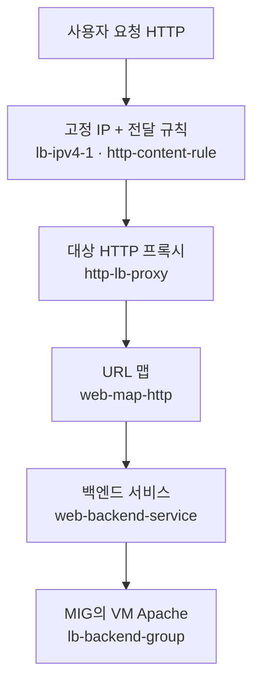

## 들어가며

로드밸런서(Load Balancer)는 들어오는 트래픽을 여러 서버로 나눠주는 장치로, 서버 한 대에 부하가 몰리지 않게 분산시켜 주는 역할을 한다.<br>
여기서는 `gcloud` CLI로 두 가지 방식의 로드밸런서를 직접 만들어 보는 실습을 리뷰할 예정.

- **1부. 네트워크 로드밸런서 (L4)** — VM 3대를 만들고 하나로 묶는 가장 기본적인 방식
- **2부. HTTP 로드밸런서 (L7)** — Template, MIG를 이용하는 확장성 있는 방식


<br><br>

# 1부. 네트워크 로드밸런서 (L4)

트래픽을 IP/포트 수준에서 단순하게 나눠주는 방식으로, 총 6단계로 구성된다.


<br>

### 1단계. 웹 서버 VM 3대 생성

먼저 트래픽을 받을 서버 3대(`web1`, `web2`, `web3`)를 만든다.
다음과 같이 반복문으로 한 번에 생성할 수 있고, 각 서버에 Apache 웹 서버를 설치하는 시작 스크립트를 넣는다.

```bash
for i in 1 2 3; do
gcloud compute instances create web$i \
  --zone=europe-west3-c \
  --machine-type=e2-small \
  --tags=network-lb-tag \
  --image-family=debian-12 \
  --image-project=debian-cloud \
  --network=default \
  --metadata=startup-script='#!/bin/bash
apt-get update
apt-get install apache2 -y
service apache2 restart
echo "<h3>Web Server: web'$i'</h3>" | tee /var/www/html/index.html'
done
```

> `--tags=network-lb-tag`는 이후 단계에서 방화벽/로드밸런서가 이 태그가 붙은 서버를 찾을 때 쓰는 태그
{: .prompt-info }

<br>

### 2단계. 방화벽 규칙 생성

외부 사용자가 서버의 80번 포트(HTTP)로 접속할 수 있도록 방화벽을 열어준다.<br> 기본적으로 GCP는 외부 접근을 막고 있기 때문에 이 과정을 해야 한다.

```bash
gcloud compute firewall-rules create www-firewall-network-lb \
  --network=default \
  --allow=tcp:80 \
  --target-tags=network-lb-tag \
  --source-ranges=0.0.0.0/0
```

<br>

### 3단계. 고정 외부 IP 예약

로드밸런서가 사용할 대표 접속 주소(고정 IP)를 미리 확보한다. IP가 바뀌지 않도록 고정해 둠.

```bash
gcloud compute addresses create network-lb-ip-1 \
  --region=europe-west3
```

<br>

### 4단계. 헬스체크 + 타겟풀 생성

> - **헬스체크(Health Check)**: 서버가 살아있는지 주기적으로 확인하는 감시 장치
> - **타겟풀(Target Pool)**: 트래픽을 나눠 보낼 서버들의 묶음

<br>

```bash
# 헬스체크 생성
gcloud compute http-health-checks create basic-check

# 타겟풀 생성 (헬스체크 연결)
gcloud compute target-pools create www-pool \
  --region=europe-west3 \
  --http-health-check=basic-check
```

<br>

### 5단계. 타겟풀에 VM 연결

4단계에서 만든 타겟풀(`www-pool`)에 실제 서버 3대를 넣고 연결.

```bash
gcloud compute target-pools add-instances www-pool \
  --instances=web1,web2,web3 \
  --instances-zone=europe-west3-c
```

<br>

### 6단계. 전달 규칙 생성 → L4 완성

마지막으로 "고정 IP로 들어온 요청을 타겟풀로 전달하라"는 규칙을 만들면 네트워크 로드밸런서가 완성된다.

```bash
gcloud compute forwarding-rules create www-rule \
  --region=europe-west3 \
  --ports=80 \
  --address=network-lb-ip-1 \
  --target-pool=www-pool
```

<br>

### 동작 확인

로드밸런서 IP로 반복 접속하면 요청이 `web1`, `web2`, `web3`으로 번갈아 분산되는 것을 볼 수 있습니다.

```bash
IPADDRESS=$(gcloud compute forwarding-rules describe www-rule \
  --region=europe-west3 --format="json" | jq -r .IPAddress)

echo "Load Balancer IP: $IPADDRESS"

while true; do curl -m1 $IPADDRESS; sleep 1; done
```

> 규칙 생성 후 모든 서버가 "정상(healthy)"으로 인식되기까지 30~60초 정도 걸릴 수 있습니다. 중지하려면 `Ctrl + C`.
{: .prompt-warning }

---

<br><br>

# 2부. HTTP 로드밸런서 (L7)


이번에는 서버를 하나씩 묶지 않고, **템플릿(설계도) → 자동 확장 그룹(MIG)** 구조로 만든다. <br>
이후 URL 맵·프록시 같은 관문을 연결해 더 똑똑하게 트래픽을 나누는 방식이다.

### 1단계. 인스턴스 템플릿 생성

1부에서 했던 방식과 다르게, 템플릿에 VM 규격과 시작 스크립트를 미리 정의해 둔다.

```bash
gcloud compute instance-templates create lb-backend-template \
  --machine-type=e2-medium \
  --image-family=debian-12 \
  --image-project=debian-cloud \
  --tags=allow-health-check \
  --metadata=startup-script='#!/bin/bash
apt-get update
apt-get install apache2 -y
service apache2 restart
echo "<h3>Web Server: Backend</h3>" | tee /var/www/html/index.html'
```

<br>

### 2단계. 관리형 인스턴스 그룹(MIG) 생성

템플릿을 바탕으로 서버 2대를 자동 생성하는 그룹을 만든다. <br>
로드밸런서가 인식할 수 있도록 HTTP 포트(80)도 매핑해 준다.

```bash
# 템플릿으로 MIG 생성 (서버 2대)
gcloud compute instance-groups managed create lb-backend-group \
  --template=lb-backend-template \
  --size=2 \
  --zone=europe-west3-c

# 포트 이름 매핑 (http:80)
gcloud compute instance-groups managed set-named-ports lb-backend-group \
  --named-ports=http:80 \
  --zone=europe-west3-c
```

<br>

### 3단계. 헬스체크용 방화벽 개방

GCP 로드밸런서가 서버 상태를 점검할 때는 구글의 전용 IP 대역에서 접근한다. 이 대역(`130.211.0.0/22`, `35.191.0.0/16`)만 열어주도록 한다.

```bash
gcloud compute firewall-rules create fw-allow-health-check \
  --network=default \
  --action=allow \
  --direction=ingress \
  --source-ranges=130.211.0.0/22,35.191.0.0/16 \
  --target-tags=allow-health-check \
  --rules=tcp:80
```

<br>

### 4단계. 글로벌 고정 외부 IP 예약

1부의 region IP와 달리, HTTP 로드밸런서는 전 세계에서 접근하는 **글로벌** IP를 사용한다.

```bash
gcloud compute addresses create lb-ipv4-1 \
  --ip-version=IPV4 \
  --global
```

<br>

### 5단계. 상태 검사(헬스체크) 생성

서버가 정상인지 확인하는 글로벌 헬스체크를 만든다.

```bash
gcloud compute health-checks create http http-basic-check \
  --port=80
```

<br>

### 6단계. 백엔드 서비스 생성 + MIG 연결

백엔드 서비스는 트래픽 분산을 담당하는 "중앙 두뇌" 역할로, 헬스체크(5단계)와 서버 그룹(2단계)을 하나로 묶는다.

```bash
# 백엔드 서비스 생성
gcloud compute backend-services create web-backend-service \
  --protocol=HTTP \
  --port-name=http \
  --health-checks=http-basic-check \
  --global

# MIG를 백엔드로 연결
gcloud compute backend-services add-backend web-backend-service \
  --instance-group=lb-backend-group \
  --instance-group-zone=europe-west3-c \
  --global
```

<br>

### 7단계. URL 맵 생성

사용자가 요청한 URL 경로에 따라 어느 백엔드로 보낼지 결정하는 "이정표"로, <br> 여기서는 모든 요청을 기본 서비스로 보낸다.

```bash
gcloud compute url-maps create web-map-http \
  --default-service=web-backend-service
```

<br>

### 8단계. 대상 HTTP 프록시 생성

외부 요청을 받아 위에서 생성한 URL 맵의 규칙대로 넘겨주는 중계 역할이다.

```bash
gcloud compute target-http-proxies create http-lb-proxy \
  --url-map=web-map-http
```

<br>

### 9단계. 글로벌 전달 규칙 생성 → L7 완성

마지막으로 고정 IP(4단계)와 프록시(8단계)를 연결하면 HTTP 로드밸런서가 완성된다.

```bash
gcloud compute forwarding-rules create http-content-rule \
  --address=lb-ipv4-1 \
  --global \
  --target-http-proxy=http-lb-proxy \
  --ports=80
```

<br><br>

---

<br>

# 참고


## 트래픽은 어떻게 흐를까?

구축은 뒤쪽(VM)부터 쌓아 올렸지만, 실제 사용자 요청은 반대로 **앞쪽(IP) 대문**으로 들어와 관문을 하나씩 통과해 VM에 도달한다.

